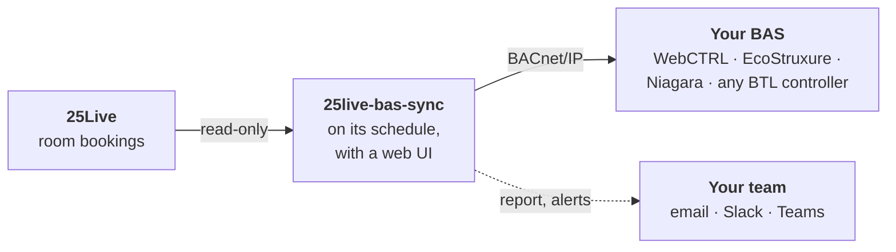

<p align="center">
  
</p>

<h1 align="center">25Live → BAS Schedule Sync</h1>

<p align="center">
  <strong>Drive building HVAC and lighting from your 25Live room bookings — over standard BACnet.</strong>
</p>

<p align="center">
  <a href="https://github.com/KSU-PlantOps/25live-bas-sync/actions/workflows/ci.yml"></a>
  <a href="https://github.com/KSU-PlantOps/25live-bas-sync/releases"></a>
  <a href="https://github.com/KSU-PlantOps/25live-bas-sync/pkgs/container/25live-bas-sync"></a>
  
  <a href="LICENSE"></a>
</p>

<p align="center">
  <a href="#quick-start">Quick start</a> ·
  <a href="docs/README.md">Documentation</a> ·
  <a href="docs/web-ui.md">Web UI</a> ·
  <a href="docs/bas-setup.md">BAS setup</a> ·
  <a href="https://github.com/KSU-PlantOps/25live-bas-sync/releases">Releases</a> ·
  <a href="CHANGELOG.md">Changelog</a>
</p>

<picture>
  <source media="(prefers-color-scheme: dark)" srcset="docs/images/dashboard-dark.png">
  
</picture>

This tool pulls confirmed events from **CollegeNET 25Live** and writes them into
your building automation system as schedule exceptions, so HVAC and lighting
pre-condition booked rooms and stand down when they're empty.

It speaks **standard BACnet**, so it isn't tied to one vendor: **Automated Logic
WebCTRL**, **Schneider EcoStruxure Building Operation**, **Tridium Niagara** and
any other BTL-listed controller all expose the same Schedule objects. One run
drives all of them at once on a mixed campus, and schedules each building as
finely as that building actually supports.

## Highlights

- **Runs itself.** One Docker container runs the sync on its schedule and
  serves a web UI for status, history, *Sync now*, and editing the room map and
  settings.
- **Set up in the browser.** A setup guide connects 25Live, lists every space
  there, booked or not, grouped by building, and adds them a building at a
  time. Then it points each building at its BAS schedule. Later buildings are
  added the same way from the room map.
- **Mixed-vendor campus in one run.** Every building names the BAS it lives on,
  and its rooms inherit it.
- **Per-room, per-floor, per-building or per-equipment scheduling**, mixed
  freely. Occupancy rolls up **room → floor → building**, so a booked room also
  runs its corridor and its building's common areas. One AHU can serve many
  rooms, and one room can drive several VAVs.
- **Pre-conditioning and run-down buffers**, set per room, per building or
  globally. Back-to-back bookings merge into clean occupancy windows.
- **Extra bookings** for what isn't in 25Live — an open house, an evening
  shift, a building 25Live doesn't have — one day or every week, on a room, a
  floor or a whole building.
- **Low temp** for events that need a room colder — a blood drive — marked in
  the web UI, driving a low-temp schedule the BAS uses to lower the setpoint.
- **What's scheduled, per space**: each room's bookings and the times written
  to its schedules, for an events team to check without seeing the rest.
- **Fails safe.** It refuses to stand the campus down because 25Live had a bad
  day, and a broken row in the room map costs you that row, not the whole run.
- **Tells you what it did.** An email report lists every schedule and the exact
  windows written, with a CSV. It can also alert Slack or Teams, and ping a
  dead-man's switch.
- **Sign in with Microsoft Entra ID**, with roles mapped from your Entra
  groups: Basic, Advanced and Admin out of the box, or your own, down to
  individual capabilities. A role can be limited to syncing particular systems
  or buildings.
- **Low-risk.** It's read-only against 25Live, and it only ever writes occupancy
  schedules. `--validate` and `--dry-run` prove a change before it goes live.

## How it works



Each run fetches the coming days' bookings (a week by default) and adds each
room's run-up and run-down. It merges them into occupancy windows and rolls
them up into floor, equipment and building schedules. It checks the result
against the last run, then writes each
schedule's `Exception_Schedule`: one special event per day, on a schedule
dedicated to bookings, which the controller combines with the zone's normal
schedule. → [How it works](docs/how-it-works.md)

## Quick start

On a Linux host or VM that can reach 25Live over HTTPS and your BAS over
BACnet/IP (UDP 47808), with Docker and the compose plugin:

```bash
git clone https://github.com/KSU-PlantOps/25live-bas-sync.git
cd 25live-bas-sync
cp .env.example .env        # set BAS_WEB_PASSWORD
mkdir -p config             # your settings will live here
docker compose up -d
```

Browse to **`http://<host>:8080`** and sign in with `BAS_WEB_PASSWORD`. The
**setup guide** opens:

1. **25Live**: your instance and service account, tested as you save.
2. **Campus**: the timezone, and how early rooms start conditioning.
3. **BAS**: a `bacnet` system, with this host's address filled in.
4. **Rooms**: it lists your 25Live spaces, booked or not, grouped by building,
   filled in from 25Live or guessed from the room names. Add a building at a time.
5. **Schedules**: each building's BACnet schedule.
6. **Check and finish**: *Validate* and a *Dry run*, then turn the schedule on.

Nothing is written to the BAS until the last step. → [The setup guide](docs/web-ui.md#the-setup-guide)

→ [Running with Docker](docs/docker.md) covers host networking, the config
folder, volumes and published images. If the host isn't on the controls
network, see [Running in a datacenter or the cloud](docs/networking.md#running-in-a-datacenter-or-the-cloud).
To run it from Task Scheduler or cron instead, see
[The command line](docs/command-line.md).

## Works with

| System | How |
|---|---|
| **Automated Logic WebCTRL** | `bacnet`: WebCTRL schedules *are* BACnet Schedule objects in the controllers, usually per room. |
| **Schneider EcoStruxure Building Operation** | `bacnet`, through EBO's BACnet Interface; or `rest`, against EBO's API. |
| **Tridium Niagara** | `bacnet`, through the station's BACnet export. Bookings show up as native special events in Workbench. |
| **Any other BTL-listed controller** | `bacnet`: a standard Schedule object whose `Exception_Schedule` can be written. |
| **Anything with an HTTP API** | `rest`: you describe the requests in `config.yaml`. |
| **Staged commissioning** | `preview`: logs and exports to CSV what it would write, while the rest of the campus writes for real. |

→ [BAS setup, by vendor](docs/bas-setup.md)

## Schedule as finely as each building allows

How granular you can be is decided by how each building was built out. All
four patterns are first-class, and they mix freely in one map:

| Pattern | When | Map the room with |
|---|---|---|
| **Per room** | The room has its own schedulable VAV or FCU, typical of WebCTRL sites | its own `target:` |
| **Per floor** | Floor-level air handling: the corridor AHU is the finest real control | a `building:` and a `floor:` |
| **Per building** | One air handler for the whole building | a `building:` only |
| **Per equipment** | One AHU for a group of rooms, or two VAVs in one room | the building's `equipment:` it's served by |

→ [How finely can you schedule?](docs/how-it-works.md#how-finely-can-you-schedule) ·
[The room map](docs/configuration.md#the-room-map)

## The web UI

Status and history, *Sync now*, the tools with live output, extra bookings,
what each space is scheduled to do, low-temp events, announcements, adding
rooms from 25Live a building at a time, and editing of rooms, buildings,
floors, equipment and every setting. Everything is
checked by the sync's own validation before it's saved. People sign in with
**Microsoft Entra ID**, and their groups decide what they can do — out of the
box:

| Role | Can |
|---|---|
| **Basic** | See the status page, sync history and what's scheduled for each space; *Sync now* — everything, or one system or building. |
| **Advanced** | See everything; run the tools; add rooms from 25Live; add and edit rooms, buildings, floors, equipment and extra bookings. |
| **Admin** | Full control: connection, passwords, alerts, schedule, safety, access, appearance, restarting the service, and *Force*. |

Change what each role may do, add your own — an events team that sees only
what's scheduled and marks events low temp, say — or limit a role to syncing
particular systems or buildings, on the Access page.

| Room map, with campuses | Each sync's report |
|---|---|
| <picture><source media="(prefers-color-scheme: dark)" srcset="docs/images/rooms-dark.png"></picture> | <picture><source media="(prefers-color-scheme: dark)" srcset="docs/images/report-dark.png"></picture> |

→ [The web UI](docs/web-ui.md): every page, setting up Entra sign-in, roles,
security, and branding with your logo and contact details.

## Built to fail safe

The dangerous failure isn't a crash. It's a run that looks successful and
writes empty schedules everywhere. An expired 25Live account or a changed query
parameter returns HTTP 200 with zero events, and a naive sync would stand the
whole campus down. Nobody would notice until Monday morning. So:

- **Each run compares itself to the last** and refuses to write if an
  implausible share of occupied schedules would suddenly be cleared.
  `--force` is there for semester break.
- **A broken row in the room map** is reported and left out, along with the
  roll-ups it feeds, and the rest of the campus syncs.
- **Writes are checked.** BACnet writes are read back, a pinned address is
  confirmed to still be the same controller, and only one sync runs at a time.
- **`--validate`** resolves every target and warns about exceptions a live run
  would replace, and **`--dry-run`** shows exactly what would be written. Neither
  writes anything.

→ [Safety rails](docs/safety.md) · [Reports and alerts](docs/reports-and-alerts.md)

## Documentation

- **Start here:** [How it works](docs/how-it-works.md) · [Running with Docker](docs/docker.md) · [The web UI](docs/web-ui.md) · [Configuration](docs/configuration.md)
- **Connect:** [25Live setup](docs/25live.md) · [BAS setup, by vendor](docs/bas-setup.md) · [Networking](docs/networking.md)
- **Operate:** [Reports and alerts](docs/reports-and-alerts.md) · [Safety rails](docs/safety.md) · [The command line](docs/command-line.md) · [Upgrading](docs/upgrading.md)

All of it, in one place: [the documentation index](docs/README.md).

## Contributing

Issues and pull requests are welcome; see [CONTRIBUTING.md](CONTRIBUTING.md).
Drivers for more BAS platforms, and support for more 25Live configurations, are
especially valuable. A new driver is one file implementing
[`ScheduleWriter`](bassync/drivers/base.py) plus a line in the registry. To
report a vulnerability, see [SECURITY.md](SECURITY.md).

## License

Licensed under the **GNU General Public License v3.0 or later**; see
[LICENSE](LICENSE). Copyright © 2026 Ryan Bibby and contributors.

> [!CAUTION]
> This software writes occupancy schedules to building automation systems.
> **Test thoroughly with `--validate` and `--dry-run`, and against a
> non-production schedule, before going live.** It is provided without
> warranty. You are responsible for validating its behavior against your own
> 25Live instance and your own BAS.
