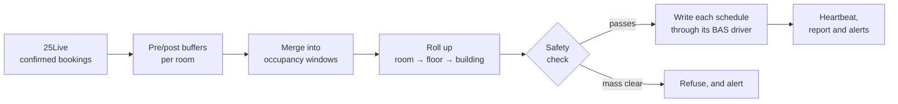

[Documentation](README.md) › How it works

# How it works

- [The pipeline](#the-pipeline)
- [Why BACnet](#why-bacnet)
- [The sync owns what it writes](#the-sync-owns-what-it-writes)
- [What goes on the wire](#what-goes-on-the-wire)
- [How finely can you schedule?](#how-finely-can-you-schedule)

## The pipeline

Each run does the same thing, whether it's started by the schedule, by
*Sync now* in the web UI, or from the command line:



1. **Fetch** the next *N* days (`lookahead_days`) of confirmed events for the
   rooms in the room map, from Series25 WebServices. Individually cancelled
   occurrences of a recurring event are skipped. Any
   [extra bookings](configuration.md#extra-bookings) — occupancy that isn't in
   25Live — join them here.
2. **Buffer** each booking: start it `pre_condition_minutes` early so the room
   is comfortable when people arrive, and hold it `post_buffer_minutes` after.
   Each is set per room, per building or globally (**room > building >
   global**).
3. **Merge** overlapping bookings, and ones closer than `merge_gap_minutes`,
   into clean occupancy windows.
4. **Roll up**: every room in a building unions into the building's schedule,
   and a room on a floor with its own schedule unions into that too. If *any*
   room is occupied, the common areas run.
5. **Check** the result against the last run, and refuse to write if it would
   stand an implausible share of the campus down — see [Safety rails](safety.md).
6. **Write** each schedule through the driver for the BAS it lives on — one
   run drives a mixed-vendor campus.
7. **Report**: bump the BAS heartbeat, ping the dead-man's switch, save the
   run's report to the history, and email it — see
   [Reports and alerts](reports-and-alerts.md).

The Python stays generic. Everything site-specific lives in three YAML files —
see [Configuration](configuration.md).

## Why BACnet

Every BTL-listed system exposes standard **Schedule objects** (ASHRAE 135
Object_Type 17) — that is what the listing requires. So rather than chase a
separate API per vendor across their version histories, the default driver
writes the one thing all of them already understand: the `Exception_Schedule`
property.

| | BACnet | Vendor REST/SOAP |
|---|---|---|
| Contract | A published standard, stable for decades | Changes across versions and add-on packs |
| Coverage | Every BTL-listed system, one code path | One integration per vendor |
| Auth | None — the network *is* the security boundary | Real accounts and TLS |
| Visibility | Exceptions show up in the vendor tool | Native objects |

The tradeoff that matters is the third row: BACnet/IP has no authentication, so
this must run on a segmented controls network (and BACnet/SC is worth asking
your vendors about for new work). Where that isn't acceptable the `rest` driver
is there.

## The sync owns what it writes

**Point each target at a schedule dedicated to bookings.** Every run replaces
that schedule's whole `Exception_Schedule` in one write — that is what makes a
run atomic and a cancelled booking actually disappear. It also means anything
else in that list, such as a holiday an operator typed in, is replaced too.

So the pattern is:

1. For each zone you drive, a **booking schedule** whose weekly schedule is
   empty or Unoccupied. The sync owns its exceptions.
2. The zone's **normal schedule** keeps the building's weekly profile, its
   holidays and shutdowns. The sync never touches it.
3. The controller combines them — typically *occupied = normal OR booking*.

`--validate` reads each target's current exceptions and warns about any the
sync didn't write, before a live run erases them. [BAS setup](bas-setup.md)
walks through this for each vendor.

## What goes on the wire

**Only `Exception_Schedule`.** The weekly schedule, `Schedule_Default` and
`Priority_For_Writing` are untouched. Each value is written in the schedule's
own datatype, read from its `Schedule_Default`: binary schedules are usually
ENUMERATED (active/inactive), and controllers reject values of the wrong type.

One special event is written **per calendar date**, with time/value pairs
alternating ON at each window start and OFF at each window end:

```
2026-06-10   09:00 → ON, 11:30 → OFF, 13:00 → ON, 17:00 → OFF
```

That matters on real hardware. A naive one-entry-per-booking encoding blows past
the `Exception_Schedule` array limits field controllers actually enforce (often
10–25 entries); grouping by date caps the array at one entry per day of
lookahead no matter how heavily booked the rooms are.

## How finely can you schedule?

This is the thing to get right, and **it is not the same campus-wide.** How
granular you can be is decided by how each building was built out, not by this
tool. All three patterns are first-class, and they mix freely in one map:

| Pattern | When | How to map it |
|---|---|---|
| **Per room** | The room has its own schedulable object — a room-level VAV or FCU. Typical of **WebCTRL** sites, where scheduling is normally done per room. | Give the room a `target:`. |
| **Per floor** | The building came online with floor-level air handling, so the corridor AHU is the finest real control. | Give the room a `building:` and a `floor:`, and **no** `target:`. |
| **Per building** | The oldest wings: one air handler for the whole building. | Give the room a `building:` and nothing else. |

A room with **no `target:` is a normal, supported mapping** — it contributes its
bookings to whatever roll-ups it belongs to and writes no schedule of its own.
Occupancy always rolls up **room → floor → building**, so a booked room drives
its own schedule (if it has one), its floor's corridor (if it names a floor),
and its building's common areas.

The only thing that *is* an error is a room with neither a `target:` nor a
`building:` — its bookings would drive nothing at all, and the loader says so
rather than swallowing them.

[The room map](configuration.md#the-room-map) has the details, and
`space_mapping.example.yaml` shows all three patterns side by side.
