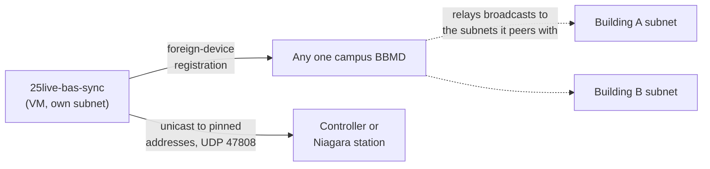

[Documentation](README.md) › Networking

# Networking for BACnet

- [On the controls network](#on-the-controls-network)
- [Running in a datacenter or the cloud](#running-in-a-datacenter-or-the-cloud)

In Docker, BACnet also needs host networking — see
[Running with Docker](docker.md#bacnet-needs-host-networking).

## On the controls network

- `local_address` must be a **real NIC address on this host**, with prefix
  length: `"10.4.1.55/24"`. The stack binds to it. If a BAS server on the same
  machine already owns UDP 47808, give the sync its own port:
  `"10.4.1.55/24:47809"`.
- If this host is **not on the controllers' subnet** — the usual case for a
  server writing to field panels — set `bbmd_address` to the BBMD for their
  network. The sync registers as a foreign device for the whole run, and
  `--validate` reports whether the BBMD acknowledged it.
- Pick a `device_id` that's free campus-wide and register it wherever your team
  tracks BACnet instance numbers.
- Pin addresses in targets (`12001:5@10.4.2.30`) on a large campus: it removes a
  broadcast round-trip per schedule and works where Who-Is doesn't cross subnets.
  The sync reads the device back at the pinned address before writing, so an
  address that has since moved to another controller fails instead of writing
  into it.

## Running in a datacenter or the cloud

The sync talks to **the devices that hold the schedules you map, and nothing
else** — not every controller on campus. Where you put the booking schedules
decides what it needs to reach:

- **On servers** — a Niagara Supervisor or station exporting its booking
  schedules over BACnet, an EBO server through the `rest` driver — and the
  sync only needs UDP 47808 (or HTTPS) to those few addresses. The server
  passes the bookings on to its own controllers. This is the easiest layout
  for a VM on its own subnet.
- **In the field controllers** — WebCTRL keeps schedules in the controllers —
  and the sync needs to reach each controller that holds a mapped schedule,
  including through each building's BACnet router for MS/TP.

Validate lists every device and schedule it will use, reading each one back.

It does **not** need to be a BBMD. On a subnet of its own:

- **Pin addresses** in targets (`2001:1@10.20.0.15`). A pinned IP device is
  plain unicast: no broadcast, no BBMD.
- **Set `bbmd_address`** to any one existing campus BBMD for anything that
  needs broadcast — unpinned targets, and routed MS/TP devices (the
  `12001:5@2001:0x21` form), whose router is found by broadcast. The sync
  registers with it as a foreign device, and that BBMD relays to every subnet
  it peers with. That BBMD must accept foreign-device registrations; Validate
  says whether it did. Making the sync a BBMD itself would need every
  building's BBMD to list it as a peer, which foreign-device registration
  avoids.

And on the network side:

- **A routed private connection** to campus (site-to-site VPN, private link)
  with **no NAT** between the VM and the BAS: BACnet/IP carries IP addresses
  inside its packets, and NAT breaks them.
- **UDP 47808 both ways** between the VM and the devices (and the BBMD).

> [!CAUTION]
> **Never expose UDP 47808 to the internet** — BACnet/IP has no
> authentication. The same goes for the web UI's port without HTTPS.
