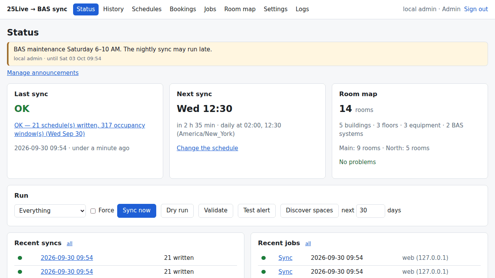
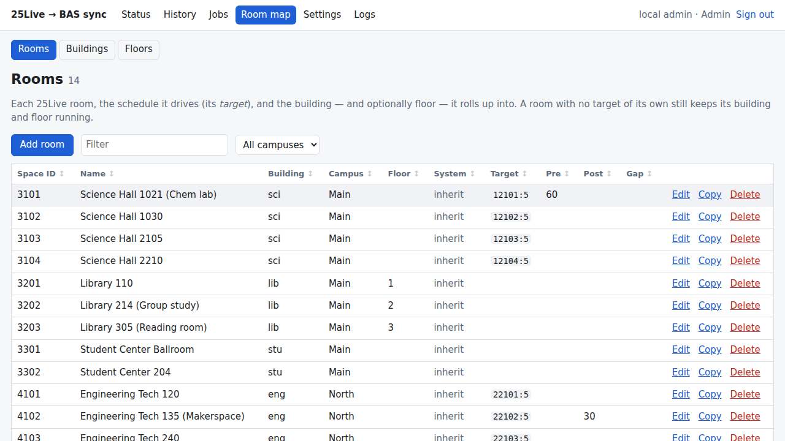
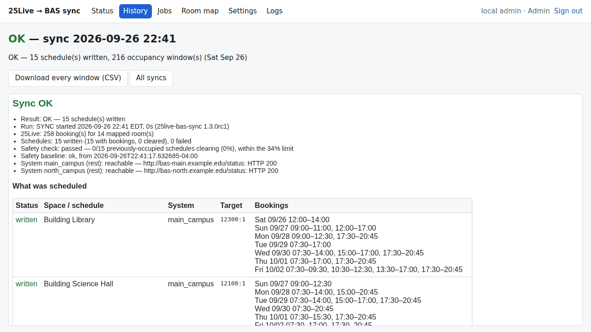
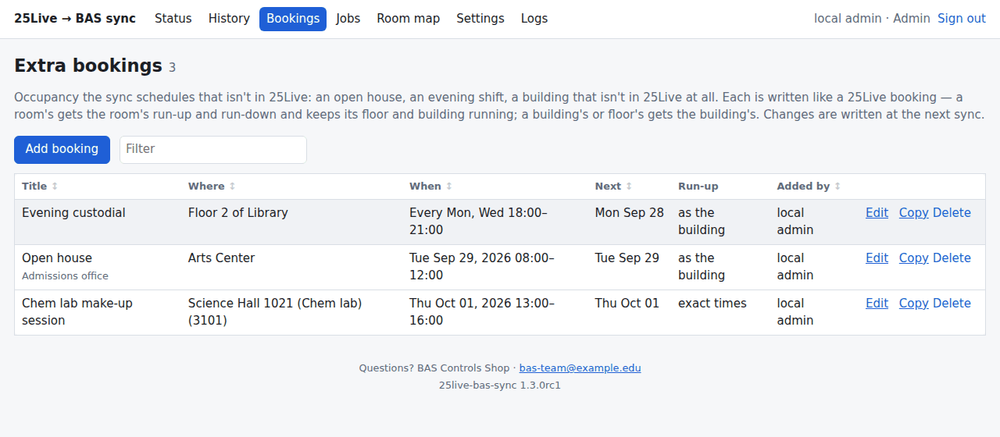
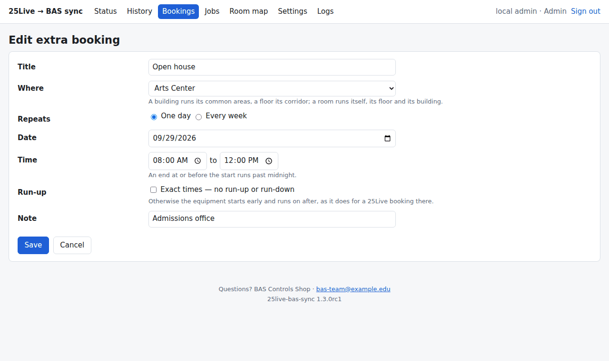
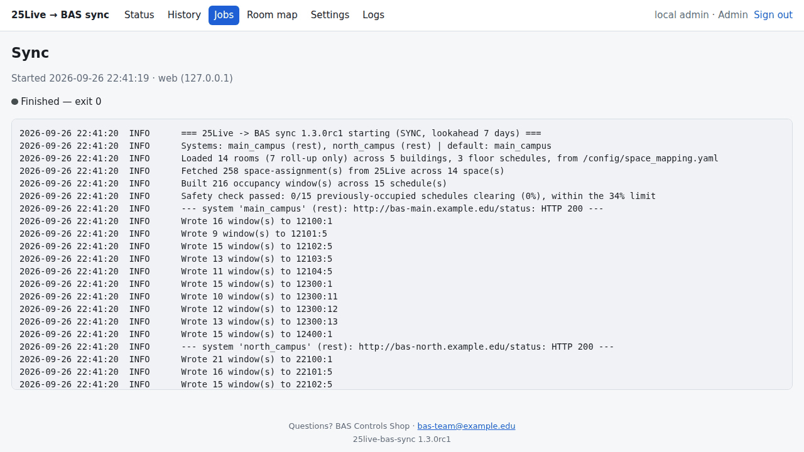
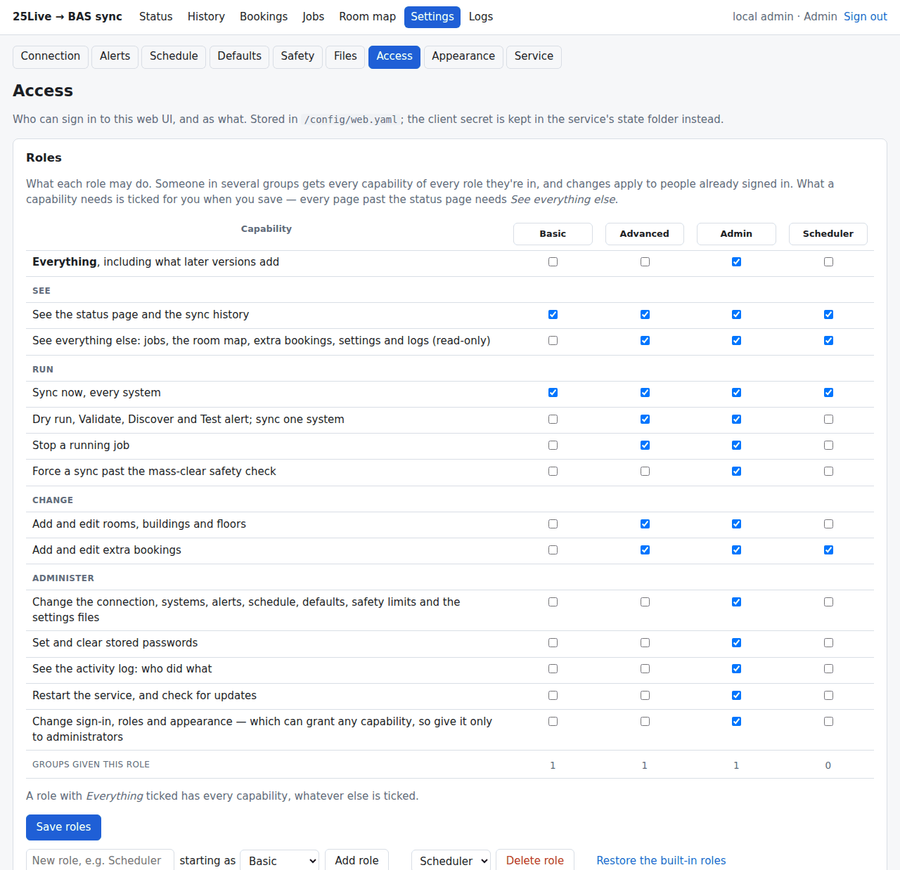
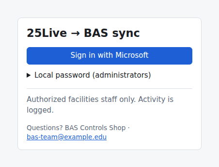

[Documentation](README.md) › The web UI

# The web UI

The container serves a web UI for running and configuring the sync: status
and history, *Sync now*, the tools with live output, and editing of the room
map and every setting — checked by the sync's own validation before anything
is saved. It follows the browser's light or dark setting.

- [Pages](#pages)
- [How it runs things](#how-it-runs-things)
- [Sign-in and roles](#sign-in-and-roles)
- [Changing the roles](#changing-the-roles)
- [Setting up Microsoft Entra sign-in](#setting-up-microsoft-entra-sign-in)
- [Security](#security)
- [Branding](#branding)
- [Without Docker](#without-docker)

<picture>
  <source media="(prefers-color-scheme: dark)" srcset="images/dashboard-dark.png">
  
</picture>

## Pages

| Page | What it does |
|---|---|
| **Status** | Last sync and its result, the next scheduled run, room-map problems, missing passwords, and buttons for *Sync now* (optionally one system, optionally *Force*), *Dry run*, *Validate*, *Test alert* and *Discover spaces*. |
| **History** | Every live sync with the report it emailed — every schedule and the exact windows written — and a CSV of every window. |
| **Bookings** | [Extra bookings](configuration.md#extra-bookings): occupancy that isn't in 25Live — one day or every week, on a room, a floor or a whole building; add, edit, copy and delete, and clear out the ones that have ended. |
| **Jobs** | Every sync and tool, from the schedule or the web, with its full output, live while it runs. A running job can be stopped. |
| **Room map** → Rooms · Buildings · Floors | The room map, with search, a campus filter and sortable columns; add, edit, copy and delete. Renaming a building repoints its rooms and floors; deleting one takes its floors and won't leave rooms driving nothing. |
| **Settings** → Connection | 25Live, BAS systems (add, remove, change driver), timezone and default system; the passwords, set or cleared here. *Validate* per system. |
| **Settings** → Alerts | Email (SMTP server, security, account and password, recipients, full or summary report, CSV), webhooks (Slack, Teams, generic) and the dead-man's-switch pings; *Send a test*. |
| **Settings** → Schedule · Defaults | When the sync runs; the run-up/run-down/merge-gap/lookahead defaults. |
| **Settings** → Safety | The [mass-clear check](safety.md) (on or off, the share of schedules one run may clear, the fewest 25Live bookings), what a broken row does, and retries; the current baseline. |
| **Settings** → Files | `config.yaml`, `defaults.yaml`, `space_mapping.yaml` and `extra_bookings.yaml` as text, for anything the forms don't cover; a zip of them all. |
| **Settings** → Access | The roles and what each may do, signing in with Microsoft Entra ID, and which Entra groups get which role. |
| **Settings** → Appearance | Your site name, logo and accent colour, and a notice and contact details on the sign-in page and at the foot of every page. |
| **Settings** → Service | The version, and whether a newer release is out; *Restart the service*; what's running — since when, as whom, where the web UI listens, the HTTPS certificate's expiry, and where each file is. |
| **Logs** | The sync's and the service's logs, and **Activity**: who did what — sign-ins, refused sign-ins, every change and every job. |

| Room map | A sync's report |
|---|---|
| <picture><source media="(prefers-color-scheme: dark)" srcset="images/rooms-dark.png"></picture> | <picture><source media="(prefers-color-scheme: dark)" srcset="images/report-dark.png"></picture> |
| **Extra bookings** | **Adding one** |
| <picture><source media="(prefers-color-scheme: dark)" srcset="images/bookings-dark.png"></picture> | <picture><source media="(prefers-color-scheme: dark)" srcset="images/booking-form-dark.png"></picture> |
| **A job's live output** | **Roles, as a table of capabilities** |
| <picture><source media="(prefers-color-scheme: dark)" srcset="images/job-dark.png"></picture> | <picture><source media="(prefers-color-scheme: dark)" srcset="images/access-dark.png"></picture> |

## How it runs things

Every sync and tool runs as the ordinary `bas-sync` command in a process of its
own, one at a time, so the web UI can't do anything the
[command line](command-line.md) couldn't — the run lock, the safety rail and
the device checks all apply.

Saving runs the same checks the nightly sync does and asks before saving
anything it would reject. Each save is atomic, keeps a `.bak`, and is refused
if someone else changed the file since you opened the form. Rewriting a file
drops its `#` comments; for a note on a row of the room map, use its **Note**
field.

## Sign-in and roles

Out of the box there are three roles, each including the one before:

| Role | Can |
|---|---|
| **Basic** | See the status page and sync history; *Sync now* (every system). |
| **Advanced** | See everything; run the tools (dry run, validate, discover, test alert), sync one system, stop a job; add and edit rooms, buildings, floors and extra bookings. |
| **Admin** | Everything: connection, systems and passwords, alerts, defaults, schedule, safety, the files, access and appearance, the activity log, restarting the service — and *Force*, which overrides the mass-clear safety check. |

They can be changed, and more added — see [Changing the roles](#changing-the-roles).

People sign in with **Microsoft Entra ID**, and their Entra groups decide the
role. The **local password** (`BAS_WEB_PASSWORD`) can do everything, to set
that up and to get back in if it breaks. Without either, the web UI stays off
and only the schedule runs.

  <picture>
    <source media="(prefers-color-scheme: dark)" srcset="images/signin-dark.png">
    
  </picture>

**Someone in several groups gets every capability of every role they're in**
(with the built-in roles, that's the highest of them). Entra lists
nested memberships in the groups claim, so a group inside another counts for
both — except with *Groups assigned to the application* (the option for very
large directories), where only groups assigned to the app directly count.

Changes on the Access page apply to people already signed in. A refused
sign-in shows there with the group values the token carried, so a mismatch
between IDs and names is easy to spot.

Access settings live in `config/web.yaml`; the client secret in the state
folder (or `BAS_WEB_SSO_CLIENT_SECRET`). If SSO breaks with the local password
off, set `local_password: true` in `web.yaml`.

## Changing the roles

The Access page shows the roles as a table: a column per role, a row per
capability. Tick what each may do and *Save roles*; rename a role in its
column's heading; *Add role* starts a new one as a copy of another. A role can
be deleted once no group has it, and *Restore the built-in roles* puts Basic,
Advanced and Admin back as they came.

| Capability | Lets someone |
|---|---|
| See the basics | See the status page and the sync history. |
| See everything | See every other page — jobs, the room map, extra bookings, settings and logs — read-only. |
| Sync now | Sync every system. |
| Run the tools | Dry run, Validate, Discover and Test alert; sync one system. |
| Stop a job | Stop a running sync or tool. |
| Force | Sync past the mass-clear safety check. |
| Edit the room map | Add and edit rooms, buildings and floors. |
| Edit extra bookings | Add and edit extra bookings. |
| Edit settings | Change the connection, systems, alerts, schedule, defaults, safety limits and the settings files. |
| Set passwords | Set and clear the stored passwords. |
| See the activity log | See who did what. |
| Restart | Restart the service, and check for updates. |
| Manage access | Change sign-in, roles and appearance — which can grant any capability, so it's for administrators. |

What a capability needs is added when a role is saved: every page past the
status page needs *See everything*, and *Force* is a kind of sync. A role with
*Everything* ticked also gets capabilities that later versions add; Admin has
it. The built-in roles aren't written to `web.yaml` until they're changed, so
they keep picking up new capabilities too.

So nobody is locked out: the local password can always do everything, and
with it turned off, a change that would leave no group able to manage access
is refused.

## Setting up Microsoft Entra sign-in

The Access page walks through this, with the exact redirect URI to use.

1. In the Entra admin center, register an app — single tenant, redirect URI of
   type *Web*: `https://<this server>/auth/callback`. Microsoft only redirects
   to HTTPS, so the web UI needs [HTTPS](#security) first.
2. Give it a client secret, and add a **groups claim** (Token configuration →
   Add groups claim → Security groups). Emit *Group ID* and enter groups by
   object ID, or, for groups synced from on-premises AD, *sAMAccountName* and
   enter them by name.
3. On the Access page: the tenant ID, client ID and secret, then the groups —
   for example `VPN_Role_PlantOps_BAS` → Basic, `BAS_Users` → Advanced,
   `BAS_Admins` → Admin. Try it in a private window, then turn the local
   password off if you like.

Sign-in uses the OpenID Connect authorization-code flow with PKCE against your
one tenant, and checks the token's audience, issuer, tenant, expiry and nonce.
A user in more groups than a token can hold is refused, with an explanation of
the fix (*Groups assigned to the application*). Government clouds (GCC High,
DoD) are a setting on the Access page.

## Security

The web UI can start a sync that writes to building controllers, so:

- **Every page and action checks a capability.** Five wrong local passwords lock
  the address out for five minutes; changing the password, the SSO app or a
  group's role applies to open sessions. Sessions last 12 hours.
- **HTTPS**: set `BAS_WEB_TLS_CERT` and `BAS_WEB_TLS_KEY`, or put it behind a
  reverse proxy that terminates TLS and set `BAS_WEB_BEHIND_PROXY=1`. Only
  behind a proxy that does its own sign-in, `BAS_WEB_AUTH=none` turns the
  password off.
- **Where it listens**: with host networking (needed for BACnet) the web UI is
  on the host's port 8080 on every interface. Set `BAS_WEB_HOST` to one
  address, and firewall the port to the people who use it.
- Forms carry CSRF tokens; a strict Content-Security-Policy allows no inline
  script and nothing from other sites, so it also works with no internet at all.
- Every change and every job is logged with who made it and from where: in
  **Logs → Activity**, and in the service log.

## Branding

**Settings → Appearance** sets:

- a **site name**, shown in the header, the sign-in page and the browser tab;
- a **logo** — PNG, JPEG or WebP, up to 512 KB (SVG is refused, because it can
  carry script), stored beside `web.yaml`;
- an **accent colour**, with black or white text on it, whichever reads better;
- a **notice** on the sign-in page (e.g. *Authorized staff only*), and
  **contact details** — a name, an email address such as
  `plantopsbas@kennesaw.edu`, and a phone number — on the sign-in page and at
  the foot of every page.

They're saved in the `branding:` section of `web.yaml`.

## Without Docker

`pip install ".[bacnet,web]"` and run `bas-sync-service` (with
`BAS_WEB_PASSWORD` set) for the same service and web UI. The
[desktop editor](command-line.md#the-desktop-editor) is the alternative for a
site that runs the sync from Task Scheduler or cron.
